# Admin guide

For people who run a brand's loyalty programme in the admin panel: `tenant_admin` (one brand) and `super_admin` (the platform owner, all brands). How admin accounts are created is in [ACCOUNTS.md](ACCOUNTS.md); what users see is in [USER_GUIDE.md](USER_GUIDE.md).

Open the panel at **`https://<your-domain>/admin`**. It works on a computer and on a phone.

## Roles

| | `tenant_admin` | `super_admin` |
|---|---|---|
| Brands visible | Only their own | All active brands, with a switcher at the top |
| Users, redemptions, ledger, rewards | Yes, own brand | Yes, any brand |
| Branding, scan rules, points and voucher settings | Yes | Yes |
| OTP limits and MSG91 sender/template IDs | Read only | Yes (these control SMS spending on the platform's MSG91 account) |
| Create brands or admin accounts | No | Not in the panel yet; see [ACCOUNTS.md](ACCOUNTS.md) |

A tenant admin cannot see or reach any other brand: another brand's pages and data simply do not exist for them.

**Every change you make is recorded** (who, when, what changed from and to, and your reason) in the audit log. There is no screen for the audit log yet; it is in the database table `admin_action_log`.

---

## Screens

### Sign in

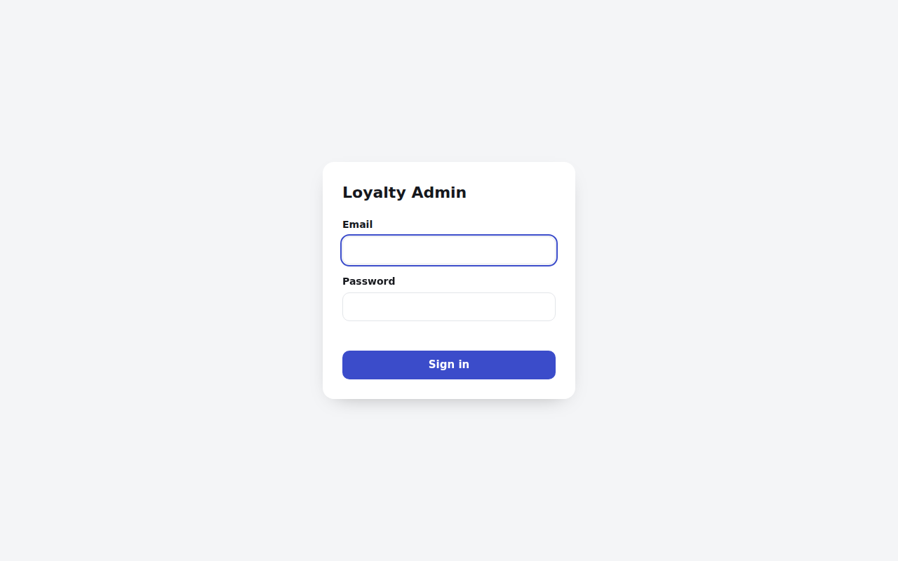

- After **5 wrong passwords in 15 minutes** the account is locked for the rest of those 15 minutes, even with the right password. The message is the same for a wrong email and a wrong password.
- Your session lasts **12 hours**; **Log out** ends it immediately.

### Users

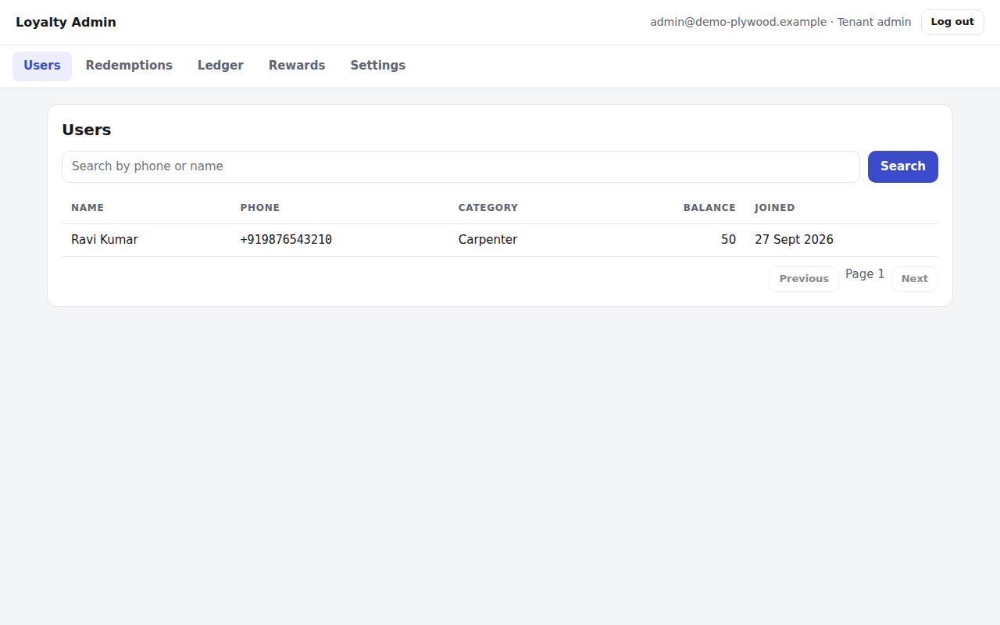

- Every user of your brand, newest first, with their **current balance**.
- **Search** by any part of the phone number or name (not case-sensitive).
- 50 per page; use **Previous / Next**.
- Click a row to open the user.

### User detail and point adjustments

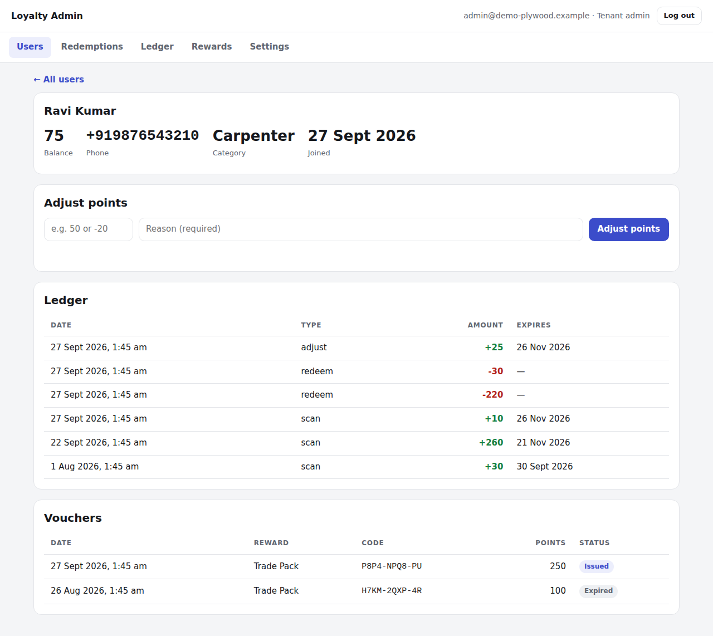

- **Balance, phone, category, joined date.**
- **Adjust points**: enter a whole number (**positive to add, negative to remove**) and a **reason** (required, 3–200 characters). The new balance appears at once.
- **Ledger**: this user's last 100 point entries (see [Reading the ledger](#reading-the-ledger)).
- **Vouchers**: this user's vouchers and their status.

### Redemptions

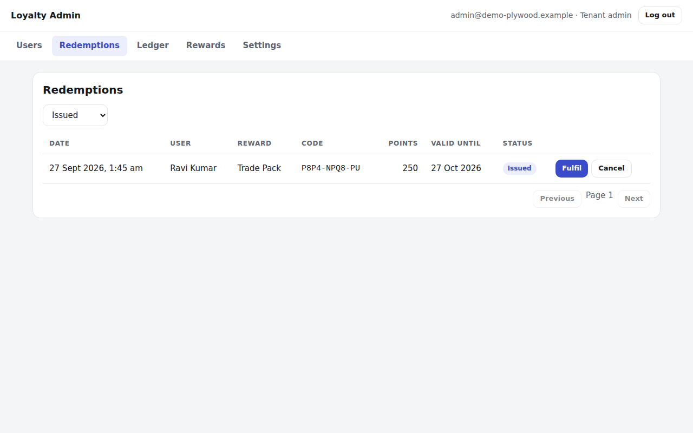

Filter by status (it opens on **Issued**, the vouchers waiting to be used). For an issued voucher:

| Fulfil | Cancel |
|---|---|
| 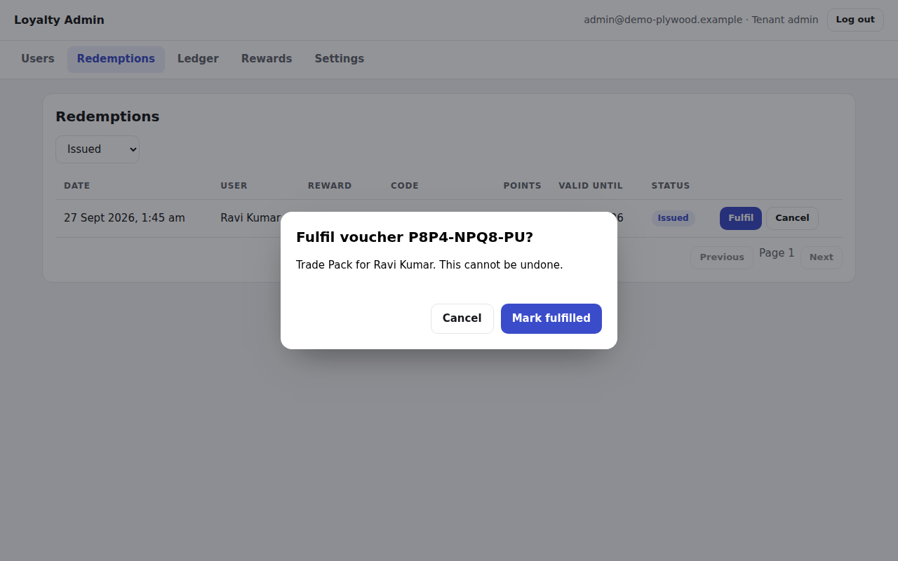 | 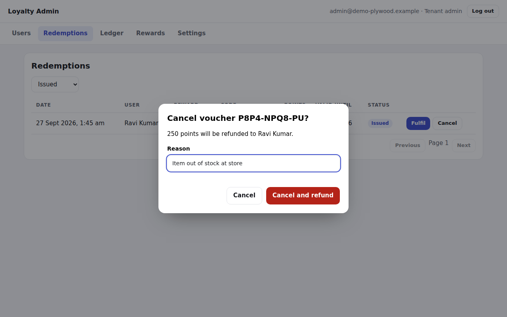 |
| Use when the customer has received the reward at the store. **Final**: it cannot be undone. | Use when the reward cannot be given. Needs a **reason**. The points go back to the user and the reward's stock goes up by 1. |

The **Valid until** column shows when the voucher expires.

### Ledger

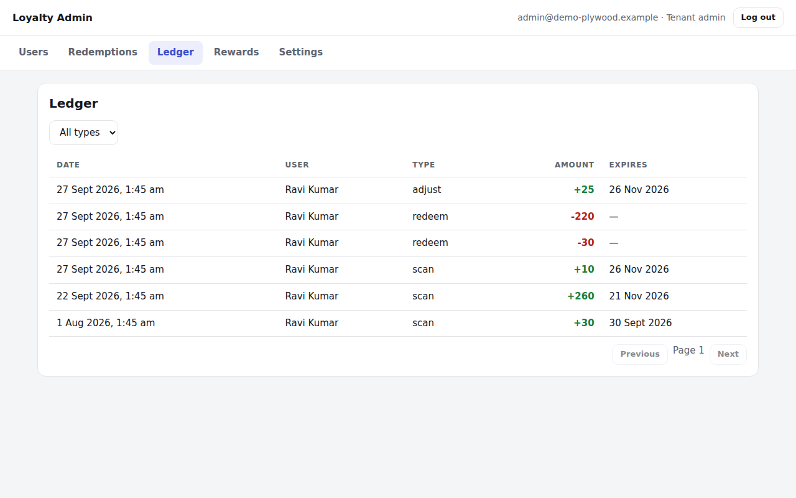

Every point entry for your brand, newest first, filterable by type. Click a row to open that user.

### Rewards

| List | Edit |
|---|---|
| 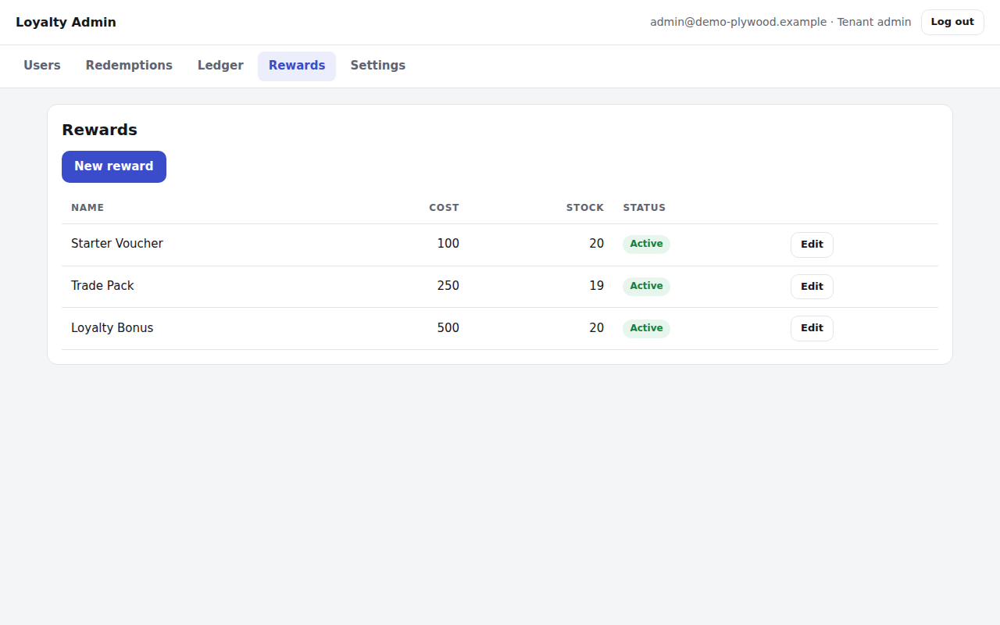 | 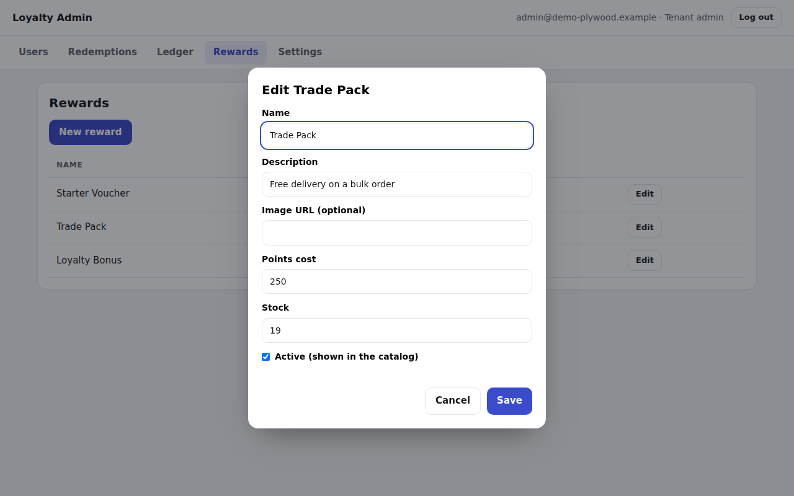 |

- **New reward**: name, description, image URL (optional; without one, the app shows a branded placeholder with the reward's initials), points cost, stock, and whether it is active.
- **Edit** changes any of these. Rewards cannot be deleted, because issued vouchers refer to them; untick **Active** to remove one from the app.
- **Stock** goes down by 1 per redemption and back up by 1 when a redemption is cancelled. At 0 the reward shows as **Out of stock** in the app.
- Only **vouchers** can be created for now.

### Settings

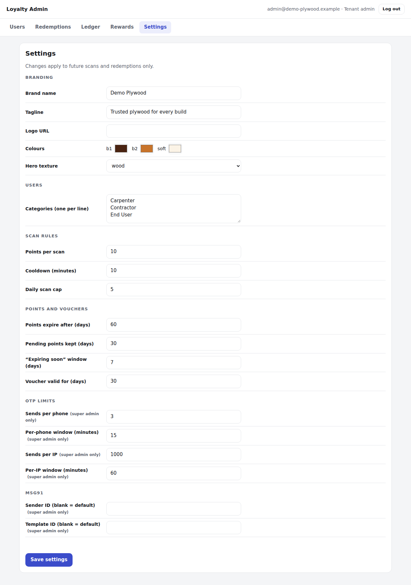

Only the fields you change are saved and logged. Settings marked *(super admin only)* are read-only for tenant admins.

| Group | Setting | Default | What it does |
|---|---|---|---|
| Branding | Brand name, Tagline | brand name, blank | Shown at the top of the app |
| | Logo URL | none | Image shown next to the name; without it, the brand's initials |
| | Colours `b1`, `b2`, `soft` | brand colours | `b1`: dark main colour (hero, headings); `b2`: accent (buttons, highlights); `soft`: page background |
| | Hero texture | none | `wood` adds a wood-grain pattern to the header |
| Users | Categories | — | The "I am a…" choices on the profile screen (1–10). **A brand needs at least one before users can sign up.** |
| Scan rules | Points per scan | 10 | Points each earning scan gives |
| | Cooldown (minutes) | 10 | Minimum gap between earning scans; 0 turns it off |
| | Daily scan cap | 5 | Earning scans per user (or anonymous phone) per IST day |
| Points and vouchers | Points expire after (days) | 60 | Life of each batch of points |
| | Pending points kept (days) | 30 | How long unclaimed anonymous points wait |
| | "Expiring soon" window (days) | 7 | How far ahead users are warned |
| | Voucher valid for (days) | 30 | Life of a new voucher |
| OTP limits \* | Sends per phone / window | 3 per 15 min | Anti-abuse limit on SMS codes |
| | Sends per IP / window | 10 per 60 min | Same, per network address |
| MSG91 \* | Sender ID, Template ID | server default | Per-brand SMS sender and template (blank = the platform default) |

\* super admin only.

**Changes apply from now on.** They never rewrite the past. See [Corner cases](#corner-cases).

### Switching brands (super admin)

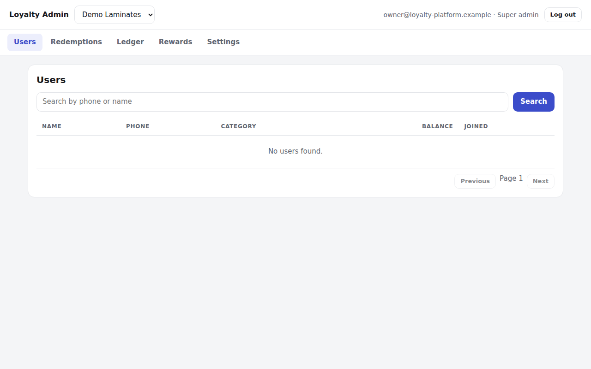

A super admin sees a brand selector at the top. Everything on screen then belongs to the selected brand.

---

## How points are calculated

### Reading the ledger

Every change to a user's points is one line in the ledger. Lines are never edited or deleted (the database refuses), so the ledger is the complete history.

| Type | Sign | Written when |
|---|---|---|
| `scan` | + | A scan is credited (logged in), or pending scans are claimed at verify/profile |
| `redeem` | − | A user redeems a reward |
| `refund` | + | An admin cancels a voucher |
| `adjust` | + or − | An admin adjusts points |
| `expire` | − | The nightly job records points that reached their expiry unused |

Every **credit** (`scan`, `refund`, positive `adjust`) has its own **expiry date** = the day it was added + *Points expire after (days)*.

Every **debit** (`redeem`, `expire`, negative `adjust`) draws from specific credits. A redemption that needs points from three credits is written as three lines; the user's app shows it as one.

### Balance

**Balance = the unspent points of all credits whose expiry date has not passed.**

- A credit stops counting at its exact expiry time, even before the nightly job writes the `expire` line.
- Nothing stores a balance; it is always calculated from the ledger, so it cannot drift.

### Spending order

Redemptions and negative adjustments use the **oldest credits first** (by date added). Since all scans expire after the same number of days, this also uses the points closest to expiry first.

### The nightly job

Every night at **00:30 India time** (`npm run expire`):

1. For each credit past its expiry with points left, it writes one `expire` line for exactly what is left.
2. It marks issued vouchers past their validity as `expired`.

It is safe to run again; it never expires the same points twice.

### Worked example

A user's ledger (expiry 60 days):

| Date | Line | Expires | Left on this credit |
|---|---|---|---|
| 1 Jan | `scan` +10 | 2 Mar | 10 → 0 |
| 5 Jan | `scan` +10 | 6 Mar | 10 → 5 |
| 20 Jan | `adjust` +20 (goodwill) | 20 Mar | 20 |
| 1 Feb | `redeem` −15 (voucher) | — | takes 10 from 1 Jan, 5 from 5 Jan |

- Balance on 1 Feb: 0 + 5 + 20 = **25**.
- On 3 Mar the 1 Jan credit has expired, but it was fully spent, so **nothing expires**; balance still 25.
- On 7 Mar the 5 Jan credit expires with 5 left: the job writes `expire` −5; balance **20**.
- If you **cancel** the 1 Feb voucher on 10 Feb: one `refund` +15 expiring 11 Apr; balance **40** on 10 Feb.

---

## Corner cases

### Settings changes

| Change | Effect on existing data |
|---|---|
| Points per scan | Only new scans. **Pending points keep the value they had when scanned.** |
| Points expire after | Only new credits. Existing credits keep their expiry date. |
| Voucher valid for | Only new vouchers. |
| Cooldown / daily cap | From the next scan. |
| Pending points kept | Applies when pending points are claimed; shortening it can make older pending scans unclaimable. |
| Categories | New profiles only; existing users keep their category, even if removed from the list. |
| Removing all categories | Not allowed. A brand with no categories cannot accept new sign-ups. |
| Colours, logo, name | Immediately in the app. |

### Redemptions and vouchers

- **Only `issued` vouchers can be fulfilled or cancelled.** `fulfilled`, `cancelled` and `expired` are final.
- **An expired voucher cannot be fulfilled** (the customer is too late) **and is not refunded.** It shows as expired as soon as its validity passes, even before the nightly job. If you want to be generous, **add the points back with an adjustment** and a reason.
- **Fulfilled by mistake?** It cannot be undone. If the customer did not get the reward, add the points back with an adjustment.
- **Cancelling refunds the points as a new credit with a fresh expiry** (60 days by default), not the original expiry dates.
- **Deactivating or restocking a reward** does not affect vouchers already issued for it.
- A user cannot redeem the same reward twice by double-tapping; each confirmation is one redemption.

### Adjustments

- A negative adjustment **cannot take the balance below zero**; you get "The user does not have enough points". Check the balance first.
- Removing points takes them from the **oldest credits first**, which may be the ones about to expire.
- Added points expire like any credit (60 days by default).
- To **move points between users** (for example a customer's new phone number): remove from the old account, add to the new one, and give the same reason on both.

### "Where are my points?"

| The user says | Check | Likely cause |
|---|---|---|
| "I scanned but got nothing" | Ledger has no new `scan` | Scan was within 10 minutes of the last earning scan, or over the daily cap. Refused scans are recorded in the database (`scan_events`) but not in the ledger. |
| "My pending points didn't come" | Ledger after they verified | They verified on a **different phone** (pending points stay on the phone that scanned), or the pending scans were more than 30 days old, or that day's cap was already reached. |
| "My balance dropped" | `expire` or `adjust` lines | Points expired (60 days), or an admin adjusted them. |
| "My voucher doesn't work" | Redemptions, status | Expired (over 30 days) or already fulfilled. |
| "I have two accounts" | Search both numbers | Each phone number is a separate account; points are not shared. Move points with adjustments. |
| "My number is registered with another brand" | — | Each brand has separate accounts. The same phone in two brands is two accounts. |

### Accounts and access

- **Locked out of the admin panel** after 5 wrong passwords: wait 15 minutes, or ask the platform owner to unlock it ([ACCOUNTS.md](ACCOUNTS.md)).
- **Forgotten password**: there is no reset screen yet; the platform owner can set a new one ([ACCOUNTS.md](ACCOUNTS.md)).
- **Removing an admin**: their session ends immediately when the account is deleted, but an admin who has made changes cannot be deleted (the audit log keeps them). See [ACCOUNTS.md](ACCOUNTS.md).
- Users cannot be deleted or have their phone number changed in the panel.
- All dates are shown in India time.

### Security notes for the platform owner

Before going live, read the open items in [STATUS.md](STATUS.md). In particular, **production must have a real `MSG91_AUTH_KEY`**: without it the app runs in test mode, where the code `000000` logs in to any number.
